# Arquitectura de BielsIA: ¿Cómo funciona el "Cerebro"?

Este documento explica el flujo de datos dentro de BielsIA. El objetivo es entender cómo el modelo no solo mira números en una hoja de cálculo, sino que entiende el **contexto** (dónde juega el jugador) y el **tiempo** (cómo evoluciona).

---

## 1. Arquitectura Principal: Transformer (Atención Global)

Esta es la configuración más potente ("BielsIA Pro"). Usa el mecanismo de **Atención** para mirar toda la carrera del jugador a la vez y decidir qué años son importantes.

```mermaid
graph LR
    %% --- ESTILOS (Alto Contraste y Texto Negro) ---
    classDef data fill:#e1f5fe,stroke:#01579b,stroke-width:2px,color:#000000;
    classDef graphNode fill:#fff9c4,stroke:#fbc02d,stroke-width:2px,stroke-dasharray: 5 5,color:#000000;
    classDef gnnProc fill:#ffecb3,stroke:#ff6f00,stroke-width:3px,shape:hexagon,color:#000000;
    classDef spatial fill:#e8f5e9,stroke:#2e7d32,stroke-width:2px,color:#000000;
    classDef temporal fill:#f3e5f5,stroke:#7b1fa2,stroke-width:2px,color:#000000;
    classDef out fill:#ffebee,stroke:#c62828,stroke-width:2px,color:#000000;
    classDef operation fill:#ffffff,stroke:#666,stroke-dasharray: 5 5,color:#000000;
    classDef ghost fill:none,stroke:none,color:#999,font-size:20px,font-weight:bold;

    %% --- BLOQUE DE ENTRADA (STACK) ---
    subgraph SPATIAL_BLOCK ["1. INPUT STACK (Historial)"]
        direction TB
        
        %% ARRIBA: 2023 (Lo más reciente)
        subgraph S23 [Temporada 2022 ]
            direction LR
            D23["Datos '22"]:::data --> G23("Grafo '22"):::graphNode --> GNN23{{"GNN Layers"}}:::gnnProc --> Emb23["Vector h<sub>23</sub>"]:::spatial
        end

        %% MEDIO: 2022 (t-1)
        subgraph S22 [Temporada 2021 ]
            direction LR
            D22["Datos '21"]:::data --> G22("Grafo '21"):::graphNode --> GNN22{{"GNN Layers"}}:::gnnProc --> Emb22["Vector h<sub>22</sub>"]:::spatial
        end

        %% ABAJO: 2021 (t-2)
        subgraph S21 [Temporada 2020 ]
            direction LR
            D21["Datos '20"]:::data --> G21("Grafo '20"):::graphNode --> GNN21{{"GNN Layers"}}:::gnnProc --> Emb21["Vector h<sub>21</sub>"]:::spatial
        end
        
        %% FONDO: Historia antigua
        subgraph S_DOTS [Historia...]
            direction LR
            DOT1["..."]:::ghost -.-> DOT2["..."]:::ghost -.-> DOT3["..."]:::ghost -.-> DOT4["..."]:::ghost
        end
    end

    %% --- BLOQUE CENTRAL (TRANSFORMER) ---
    subgraph TEMPORAL ["2. ENCODER TEMPORAL"]
        direction TB
        PE(("+ Positional Encoding")):::operation
        TE["Transformer Encoder<br>(Self-Attention Global)"]:::temporal
        CTX["Vector de Contexto"]:::temporal

        %% CONEXIONES (Efecto Embudo)
        %% Conectamos todo al PE
        Emb23 --> PE
        Emb22 --> PE
        Emb21 --> PE
        DOT4 -.-> PE

        PE --> TE --> CTX
    end

    %% --- SALIDA ---
    subgraph OUTPUT ["3. INFERENCIA"]
        direction LR
        MLP["MLP Head"]:::out
        RES("Predicción 2023<br>(Target)"):::out
        
        CTX --> MLP --> RES
    end

    %% --- ORDEN VISUAL FORZADO ---
    %% Esto asegura que 2023 quede visualmente arriba
    S23 ~~~ S22 ~~~ S21 ~~~ S_DOTS

    %% --- ESTILO ---
    linkStyle default stroke:#666,stroke-width:2px,fill:none,interpolation:basis;
```



## 2. Arquitectura Alternativa: LSTM (Secuencial)

Esta es la configuración clásica ("BielsIA Lite"). Procesa la carrera paso a paso, como si leyera un libro, llevando una "memoria" del pasado.

```mermaid
graph TD
    %% Estilos (Mismos que arriba)
    classDef data fill:#e1f5fe,stroke:#01579b,stroke-width:2px;
    classDef spatial fill:#e8f5e9,stroke:#2e7d32,stroke-width:2px;
    classDef temporal fill:#f3e5f5,stroke:#7b1fa2,stroke-width:2px;
    classDef memory fill:#e0f7fa,stroke:#006064,stroke-dasharray: 5 5;
    classDef out fill:#ffebee,stroke:#c62828,stroke-width:2px;

    subgraph SEQUENCE ["PROCESAMIENTO SECUENCIAL"]
        direction LR
        
        subgraph T1 ["Paso 1 (2021)"]
            In1[Datos '21]:::data --> GNN1[GNN]:::spatial
            GNN1 --> LSTM1[Celda LSTM]:::temporal
            H0((h0)):::memory -.-> LSTM1
        end
        
        subgraph T2 ["Paso 2 (2022)"]
            In2[Datos '22]:::data --> GNN2[GNN]:::spatial
            GNN2 --> LSTM2[Celda LSTM]:::temporal
            LSTM1 -.->|Memoria (h1)| LSTM2
        end

        subgraph T3 ["Paso 3 (2023)"]
            In3[Datos '23]:::data --> GNN3[GNN]:::spatial
            GNN3 --> LSTM3[Celda LSTM]:::temporal
            LSTM2 -.->|Memoria (h2)| LSTM3
        end
    end

    LSTM3 --> Final[Estado Final h3]:::temporal
    Final --> MLP[Cabezal de Predicción]:::out
    MLP --> Pred[Predicción 2024]:::out
```

---

## 3. Explicación de Componentes

### A. El "Ojo Espacial" (Común a ambos)
Independientemente de si usamos Transformer o LSTM, el primer paso es siempre entender el **contexto anual**.
*   **Input**: Stats del jugador + Conexiones (Equipo, Posición).
*   **Proceso**: Una GNN (Graph Neural Network) o Graphormer "conversa" con los vecinos.
    *   *Ejemplo*: "Soy un delantero (nodo), pero mi equipo (vecino) crea pocas chances. La GNN ajusta mi vector para reflejar que mis pocos goles tienen más mérito".
*   **Output**: Un vector (embedding) por año.

### B. El "Cerebro Temporal" (La Diferencia)

| Característica | **Transformer** (Diagrama 1) | **LSTM** (Diagrama 2) |
| :--- | :--- | :--- |
| **Cómo lee** | Lee todos los años simultáneamente (Paralelo). | Lee año por año (Secuencial). |
| **Mecanismo** | **Self-Attention**: Puede decidir que 2019 es más importante que 2022 para predecir 2024. | **Memoria Recurrente**: Acumula información en un estado oculto ($h_t$). Tiende a olvidar el pasado lejano. |
| **Fortaleza** | Detecta patrones complejos y relaciones a largo plazo. | Muy bueno para tendencias suaves y continuidad inmediata. |
| **Uso en BielsIA** | Modelo Principal (Mejores resultados). | Baseline de comparación. |

### C. La Predicción (Output)
El vector final (sea del Transformer o el último estado de la LSTM) pasa por una capa lineal simple (MLP) que proyecta a las 11 dimensiones que queremos predecir (Goles, Asistencias, Minutos, etc.).
*   **Importante**: La salida está normalizada (StandardScaler). Se desnormaliza después para obtener los valores reales.
