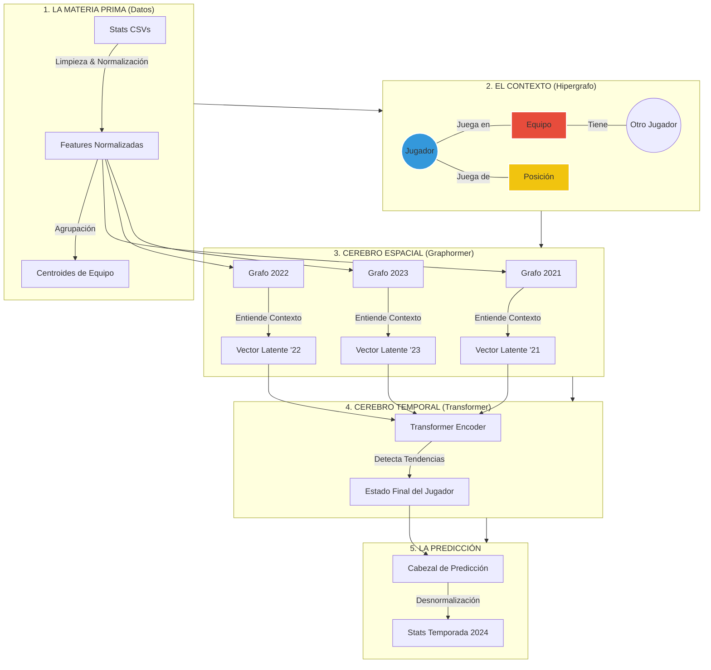

# Arquitectura de BielsIA: ¿Cómo funciona el "Cerebro"?

Este documento explica el flujo de datos dentro de BielsIA. El objetivo es entender cómo el modelo no solo mira números en una hoja de cálculo, sino que entiende el **contexto** (dónde juega el jugador) y el **tiempo** (cómo evoluciona).

---

## 1. El Diagrama de Flujo (The Big Picture)

Imagina que el modelo tiene dos "ojos": uno para ver las relaciones (quién juega con quién) y otro para ver la historia (pasado vs futuro).

---

## 2. Explicación Paso a Paso

### Paso 1: La Construcción del "Mundo" (El Grafo)
A diferencia de un Excel donde cada fila es independiente, BielsIA construye un **Grafo**.
*   **Nodos**: Cada Jugador es un punto. Pero también creamos puntos para los **Equipos** y las **Posiciones**.
*   **Conexiones**:
    *   Si Haaland juega en el City, hay una línea conectándolos.
    *   Si el City es un equipo muy ofensivo, el nodo "City" tiene esa información (Goles, Posesión).
    *   **¿Por qué sirve esto?**: El modelo aprende que "Jugar en el City" (nodo rojo) te da más probabilidades de meter goles que "Jugar en el Sheffield". El contexto importa.

### Paso 2: La Foto Anual (Graphormer / GNN)
El modelo toma una "foto" de cada temporada por separado (ej. 2021, 2022, 2023).
*   Usa una **GNN (Graph Neural Network)** llamada *Graphormer*.
*   Esta red mira al jugador y a sus vecinos (su equipo, su posición).
*   **Resultado**: Convierte los stats crudos en un "Vector de Entendimiento" (Embedding) que resume qué tan bueno fue ese jugador ese año *considerando su contexto*.

### Paso 3: La Película (Transformer Temporal)
Ahora tenemos una secuencia de vectores: `[Yo en 2021] -> [Yo en 2022] -> [Yo en 2023]`.
*   Aquí entra el **Transformer** (la misma tecnología que ChatGPT).
*   Analiza la secuencia para encontrar patrones ocultos:
    *   *¿Está mejorando explosivamente?*
    *   *¿Está en declive por la edad?*
    *   *¿Fue 2022 un año atípico por lesión?*
*   El Transformer presta "atención" a los años más relevantes para predecir el futuro.

### Paso 4: La Predicción (Output)
El modelo escupe un vector de números normalizados (ej. +1.5 sigmas en Goles).
*   **Desnormalización**: Nosotros tomamos ese número y, usando la "regla" que aprendimos de los datos reales, lo convertimos a números humanos.
*   **Resultado Final**: "Haaland meterá 28 goles y jugará 2900 minutos en 2024".

---

## 3. ¿Por qué esta arquitectura?

| Enfoque Tradicional (Excel/Regresión) | Enfoque BielsIA (GNN + Transformer) |
| :--- | :--- |
| Trata a cada año como un dato aislado. | Entiende la **secuencia temporal** (tendencias). |
| Ignora el equipo (o lo usa como texto simple). | Entiende el **estilo del equipo** (posesión, defensa). |
| Se confunde si un jugador cambia de equipo. | El grafo se adapta dinámicamente a los traspasos. |
| Predice mal volúmenes (Minutos/Tackles). | Usa **normalización** para aprender todas las escalas por igual. |
